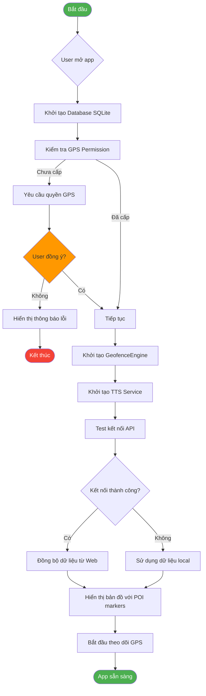
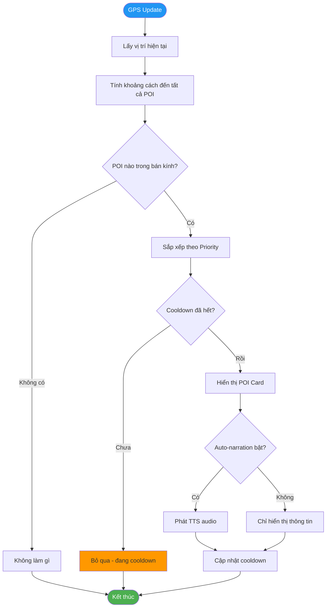
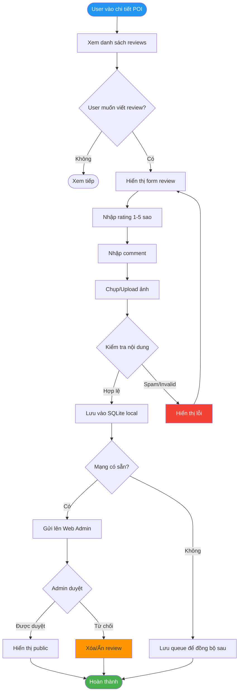
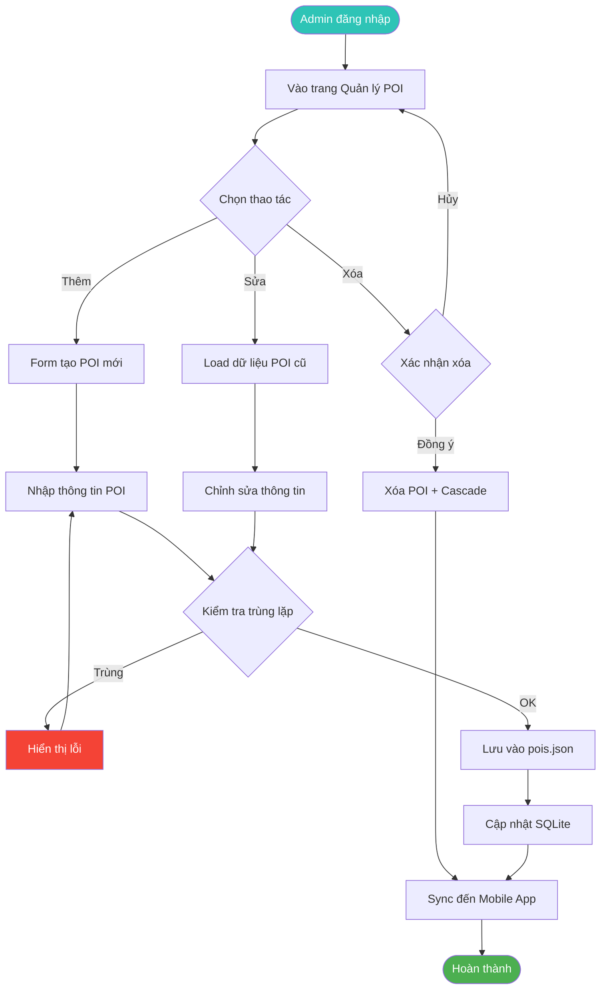
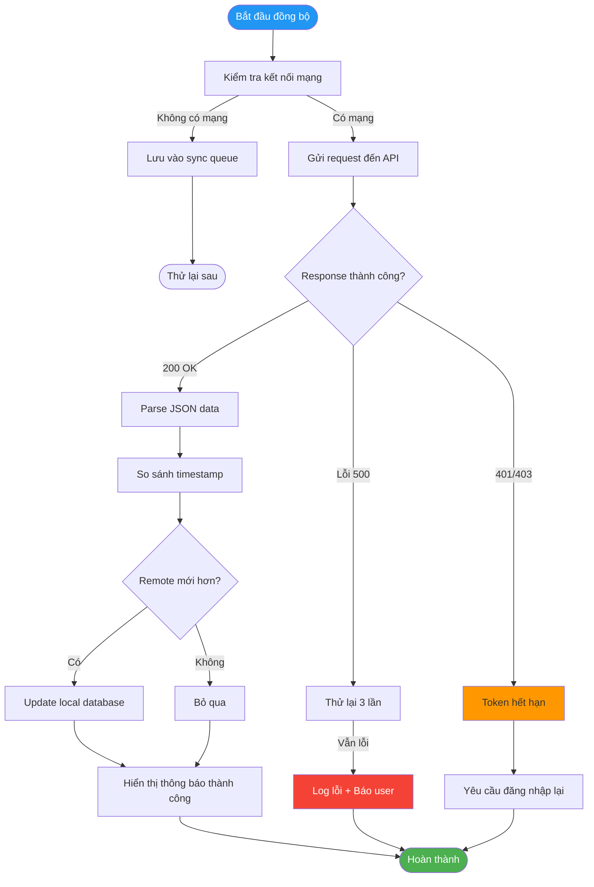

# 📊 Use Case & Activity Diagrams

## 1. Use Case Diagram - FoodStreetGuide

```mermaid
flowchart TB
    subgraph Actor["👤 Actor"]
        User["Người dùng (User)"]
        Admin["Quản trị viên (Admin)"]
    end

    subgraph App["📱 FoodStreetGuide App"]
        UC1["Xem bản đồ POI"]
        UC2["Tìm kiếm quán ăn"]
        UC3["Lọc theo danh mục"]
        UC4["Xem chi tiết POI"]
        UC5["Nghe thuyết minh tự động"]
        UC6["Lưu POI yêu thích"]
        UC7["Viết đánh giá"]
        UC8["Chia sẻ quán ăn"]
        UC9["Quét QR check-in"]
        UC10["Thay đổi ngôn ngữ"]
        UC11["Bật/Tắt thông báo"]
        UC12["Xem lịch sử đã lưu"]
    end

    subgraph AdminWeb["🌐 Web Admin"]
        UC13["Quản lý POI (CRUD)"]
        UC14["Quản lý đánh giá"]
        UC15["Quản lý người dùng"]
        UC16["Xem thống kê/Phân tích"]
        UC17["Phân quyền"]
        UC18["Xem hoạt động"]
        UC19["Cài đặt hệ thống"]
    end

    subgraph System["⚙️ Hệ thống"]
        UC20["Theo dõi vị trí GPS"]
        UC21["Tính khoảng cách"]
        UC22["Kiểm tra Geofence"]
        UC23["Phát audio TTS"]
        UC24["Đồng bộ dữ liệu"]
    end

    User --> UC1
    User --> UC2
    User --> UC3
    User --> UC4
    User --> UC5
    User --> UC6
    User --> UC7
    User --> UC8
    User --> UC9
    User --> UC10
    User --> UC11
    User --> UC12

    Admin --> UC13
    Admin --> UC14
    Admin --> UC15
    Admin --> UC16
    Admin --> UC17
    Admin --> UC18
    Admin --> UC19

    UC5 -.->|include| UC23
    UC22 -.->|include| UC20
    UC22 -.->|include| UC21
    UC1 -.->|include| UC22
    UC4 -.->|extend| UC5
    UC6 -.->|include| UC24
    UC7 -.->|include| UC24

    style User fill:#FF6B35,color:#fff
    style Admin fill:#2EC4B6,color:#fff
    style UC5 fill:#ffd700
    style UC22 fill:#ffd700
    style UC23 fill:#ffd700
```



---

## 2. Activity Diagram - Luồng chính của App

### 2.1 App Launch & Khởi động



---

### 2.2 Geofence Trigger - Auto Narration



---

### 2.3 User Review Flow



---

### 2.4 Web Admin - Quản lý POI



---

### 2.5 Data Synchronization



---

### 2.6 QR Code Scan & Check-in

```mermaid
flowchart TD
    A([User bấm Quét QR]) --> B[Kiểm tra Camera Permission]
    B -->|Chưa cấp| C[Yêu cầu quyền camera]
    C --> D{User đồng ý?}
    D -->|Không| E[Không thể quét]
    D -->|Có| F[Mở Camera Preview]
    B -->|Đã cấp| F
    F --> G[Quét QR Code]
    G --> H{QR hợp lệ?}
    H -->|Không| I[Hiển thị lỗi]
    H -->|Có| J[Trích xuất POI ID]
    J --> K[Lấy thông tin POI]
    L --> M[Tăng visit count]
    M --> N[Hiển thị "Check-in thành công"]
    N --> O[Chuyển đến POI Detail]
    I --> P([Thử lại])
    E --> P
    O --> Q([Hoàn thành])
    
    style A fill:#2196F3,color:#fff
    style Q fill:#4CAF50,color:#fff
    style H fill:#ff9800
    style E fill:#f44336,color:#fff
```

---

## 📝 Legend (Chú thích)

| Ký hiệu | Ý nghĩa |
|---------|---------|
| ⭕ Circle | Start/End point |
| 🔷 Diamond | Decision (quyết định) |
| ⬜ Rectangle | Activity/Process |
| 🔵 Dotted line | Include/Extend relationship |
| 🟢 Green | Success/Complete |
| 🔴 Red | Error/Failure |
| 🟠 Orange | Warning/Decision point |
| 🟡 Yellow | Highlight/Important |

---

## 🎯 Cách render thành hình ảnh:

### Cách 1: Mermaid Live Editor
1. Truy cập: https://mermaid.live/
2. Copy code diagram vào
3. Export PNG/SVG/PDF

### Cách 2: VS Code
- Cài extension: **Markdown Preview Mermaid Support**
- Mở file này → Preview → Save as image

### Cách 3: Node.js CLI
```bash
npm install -g @mermaid-js/mermaid-cli
mmdc -i DIAGRAMS.md -o output.png
```

---

*Generated for FoodStreetGuide - Khám phá Ẩm thực Đường phố*
