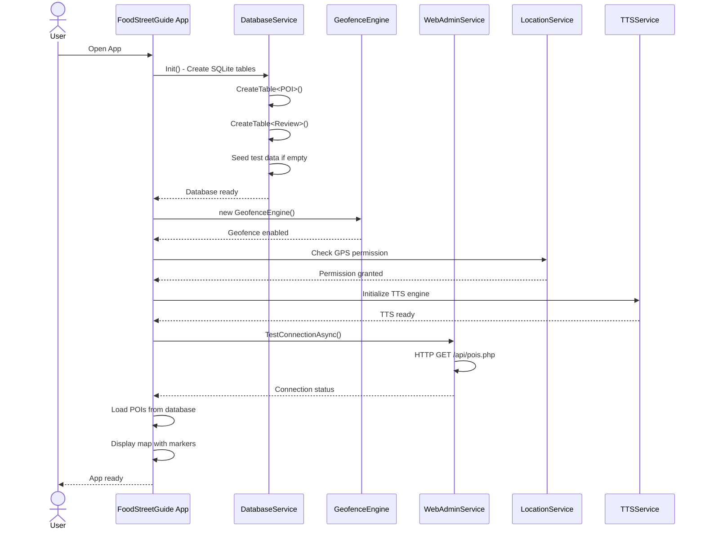
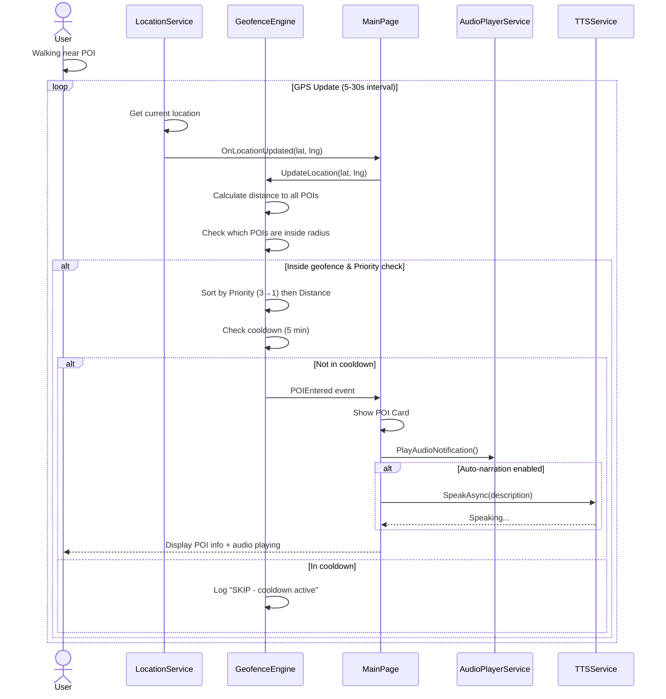
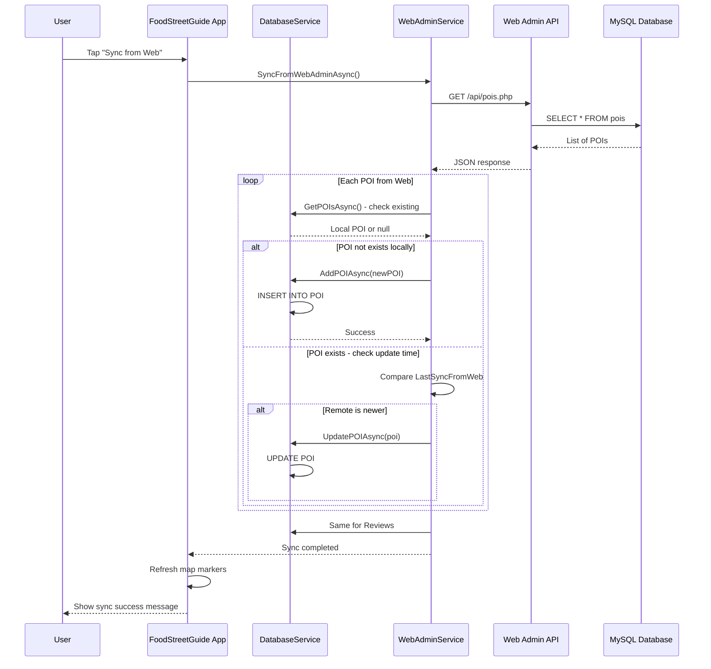
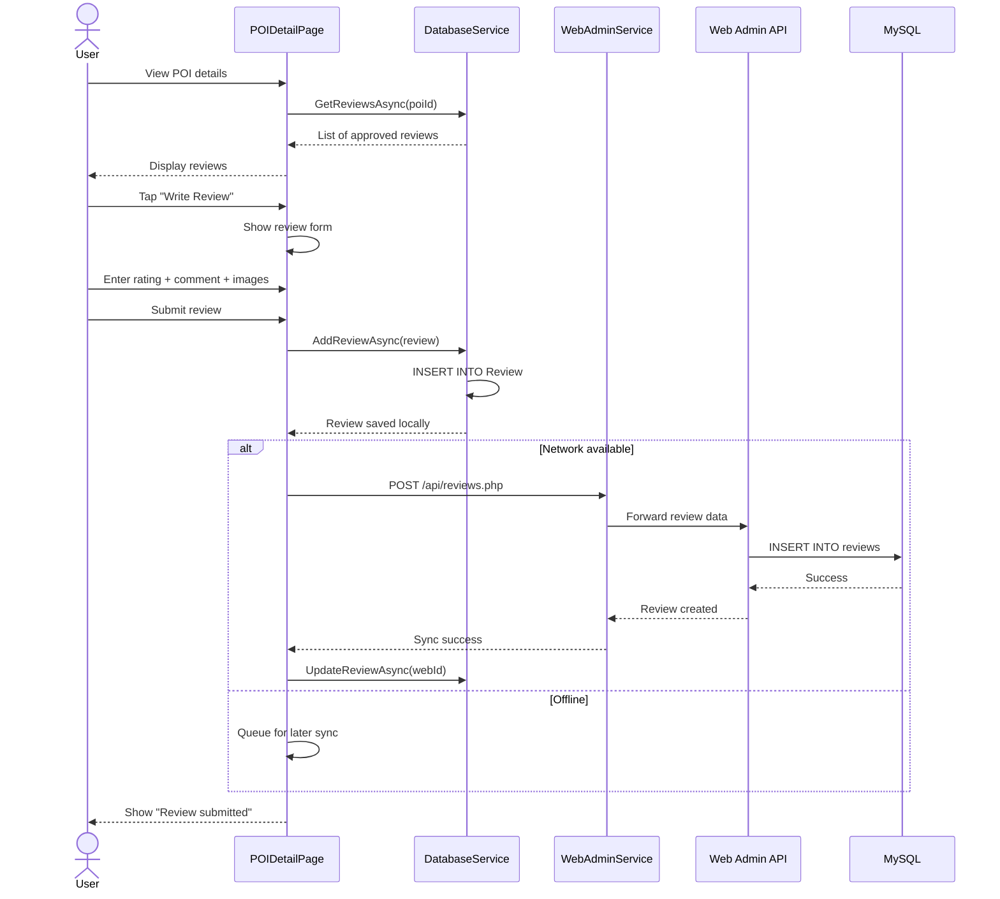
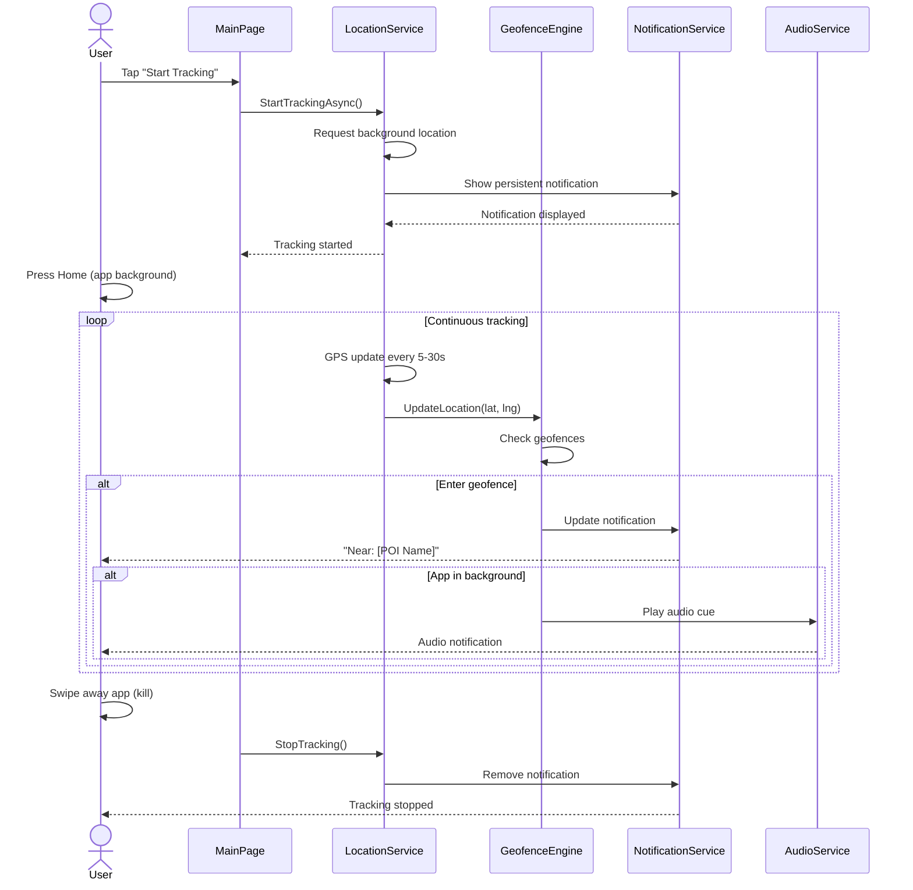
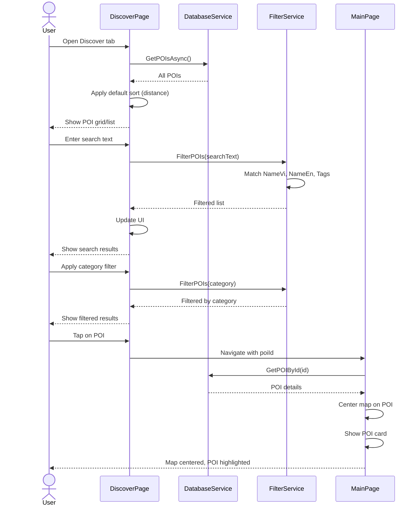
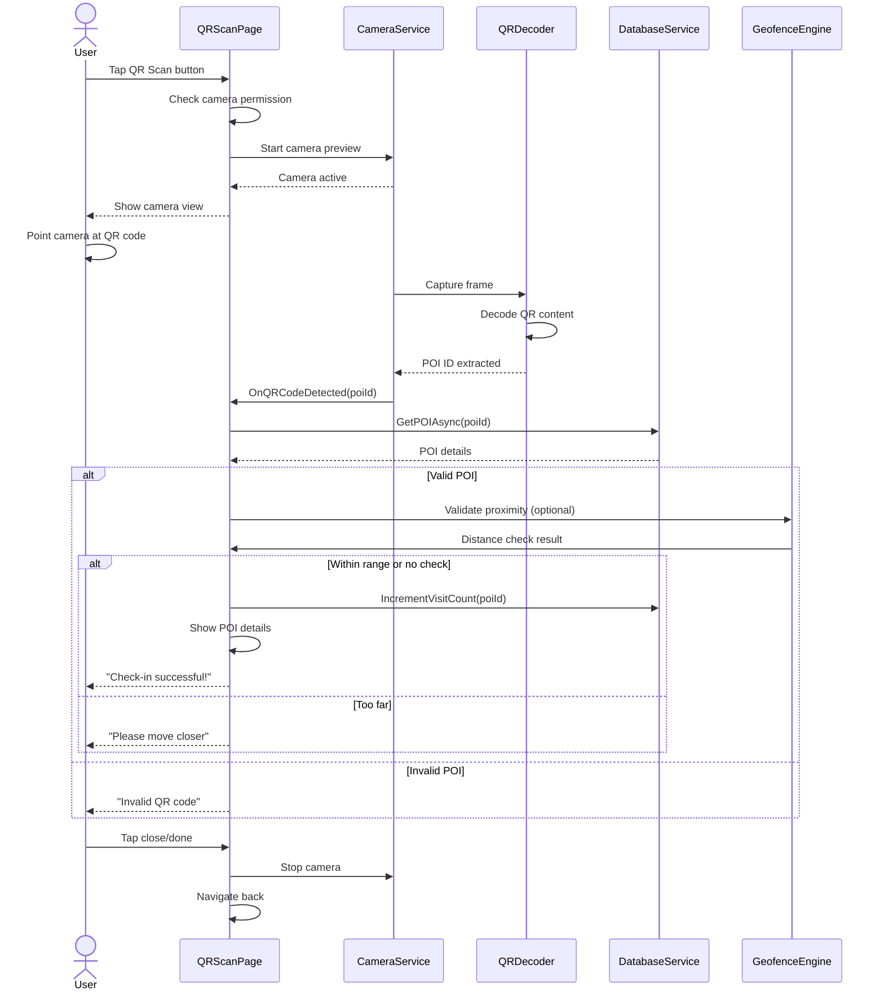
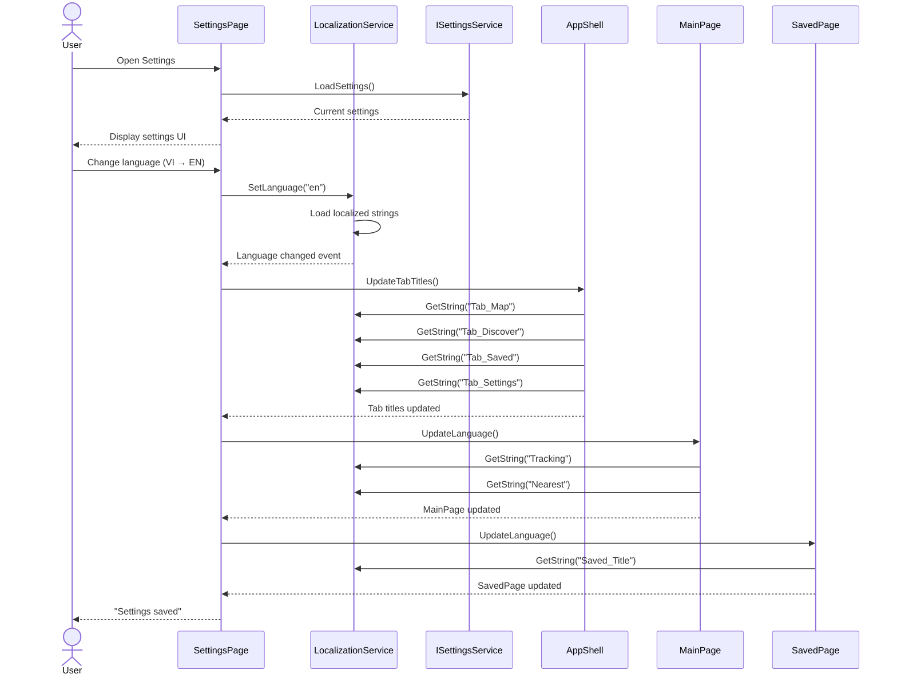
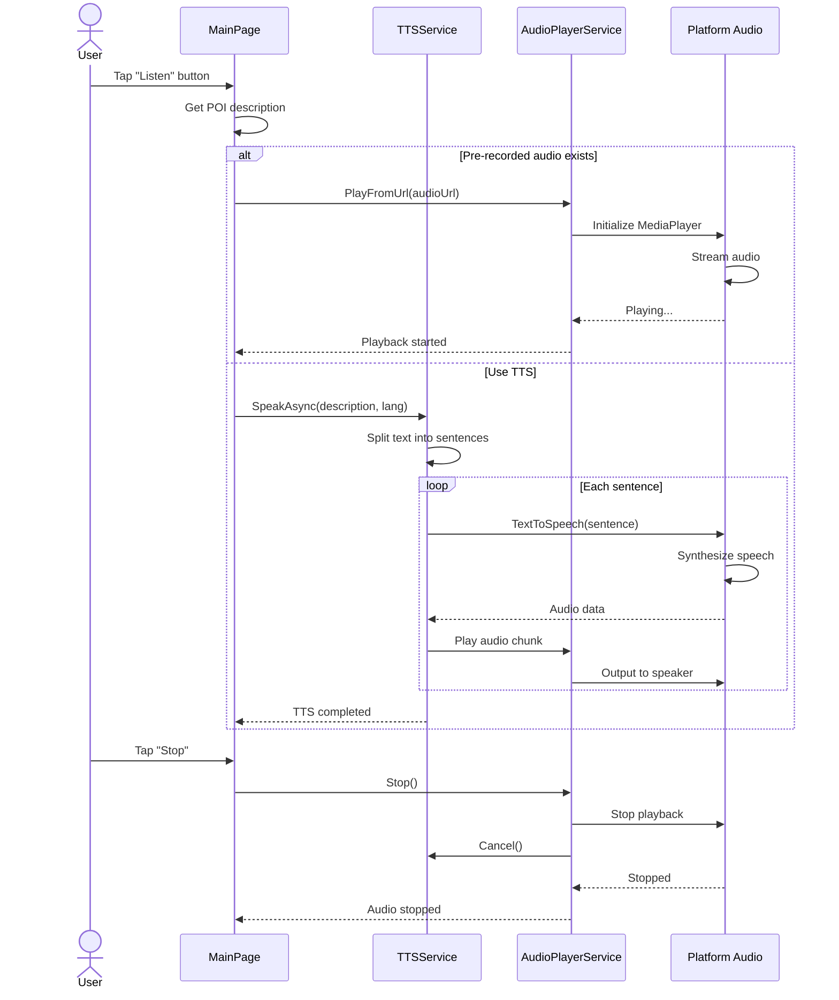
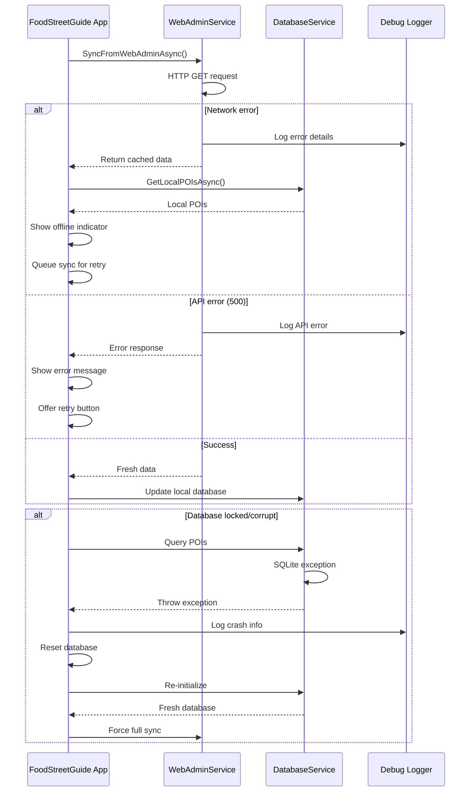

# 🔄 Sequence Diagrams
## FoodStreetGuide - Hệ thống Du lịch Ẩm thực   

---

## 1. App Launch & Initialization

---

## 2. Geofence Trigger - Auto Narration

---

## 3. Data Synchronization (Web → Mobile)

---

## 4. User Reviews Flow

---

## 5. Background Tracking with Notification

---

## 6. POI Discovery & Search

---

## 7. QR Code Scan & Check-in

---

## 8. Settings & Localization

---

## 9. Audio Narration Pipeline

---

## 10. Error Handling & Recovery

---

## Diagram Key

| Symbol | Meaning |
|--------|---------|
| `->>` | Synchronous call |
| `-->>` | Return response |
| `->` | Asynchronous event |
| `alt` | Alternative flow (if/else) |
| `loop` | Repeated operation |
| `par` | Parallel processing |
| `activate` | Object active |
| `deactivate` | Object inactive |

---

## System Components Reference

| Component | Responsibility |
|-----------|----------------|
| **MainPage** | Map display, POI cards, user interaction |
| **DiscoverPage** | POI list, search, filters |
| **SavedPage** | Favorites management |
| **GeofenceEngine** | Location monitoring, trigger logic |
| **LocationService** | GPS tracking, permissions |
| **WebAdminService** | API communication, sync |
| **DatabaseService** | SQLite CRUD operations |
| **TTSService** | Text-to-speech narration |
| **AudioPlayerService** | Audio playback |
| **LocalizationService** | Multi-language support |
