# 🍜 Food Tour System - UML Diagrams

## 📋 Danh sách chức năng và sơ đồ

| # | Chức năng | Use Case | Activity | Sequence |
|---|-----------|----------|----------|----------|
| 1 | Người dùng mở app xem bản đồ | ✅ | ✅ | ✅ |
| 2 | Người dùng vào vùng POI (Geofence) | ✅ | ✅ | ✅ |
| 3 | Người dùng xem chi tiết POI | ✅ | ✅ | ✅ |
| 4 | Người dùng check-in bằng QR | ✅ | ✅ | ✅ |
| 5 | Người dùng đánh giá POI | ✅ | ✅ | ✅ |
| 6 | Admin quản lý nhà hàng (POI) | ✅ | ✅ | ✅ |
| 7 | Admin/Owner tạo QR code | ✅ | ✅ | ✅ |
| 8 | Admin/Owner xem thống kê | ✅ | ✅ | ✅ |
| 9 | Admin quản lý đánh giá | ✅ | ✅ | ✅ |
| 10 | Đồng bộ dữ liệu App ↔ Web Admin | ✅ | ✅ | ✅ |

---

## 1️⃣ USE CASE DIAGRAMS

### UC-01: Tổng quan hệ thống

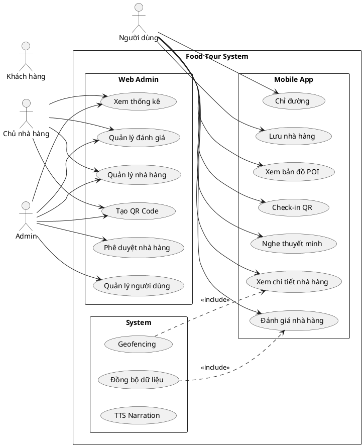

---

### UC-02: Mobile App - Xem bản đồ và POI

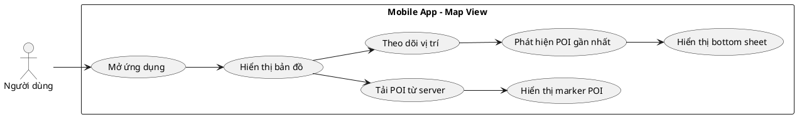

---

### UC-03: Mobile App - Check-in QR

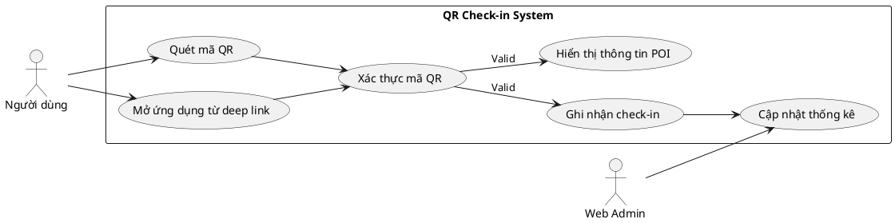

---

### UC-04: Mobile App - Đánh giá nhà hàng

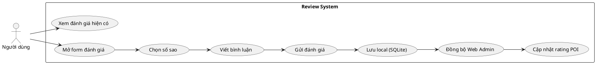

---

### UC-05: Web Admin - Quản lý nhà hàng

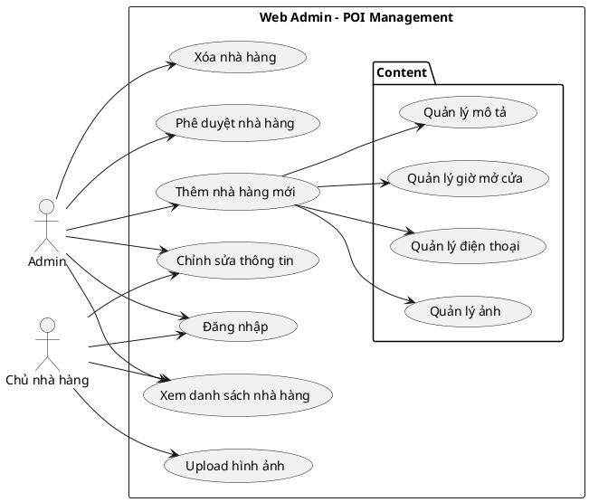

---

### UC-06: Web Admin - Quản lý QR Code

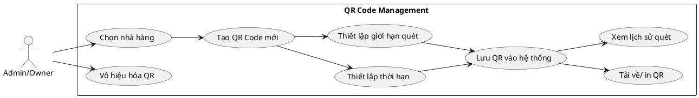

---

### UC-07: Web Admin - Thống kê & Analytics

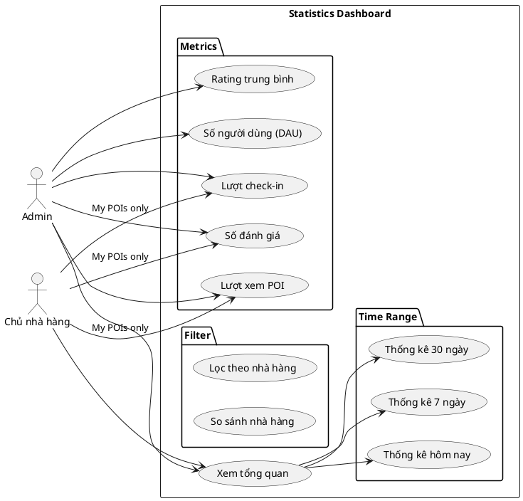

---

## 2️⃣ ACTIVITY DIAGRAMS

### ACT-01: Người dùng mở app và xem bản đồ

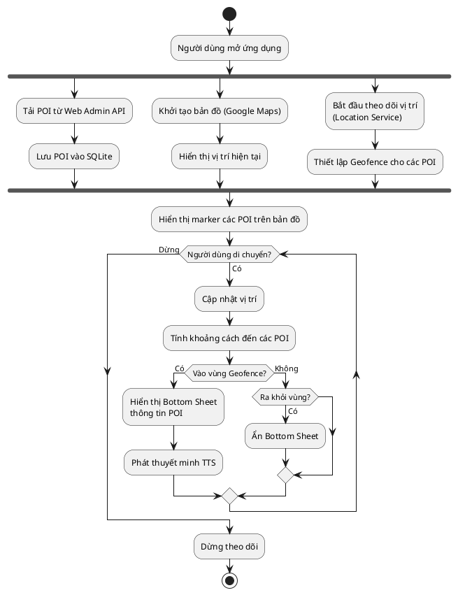

---

### ACT-02: Người dùng check-in bằng QR Code

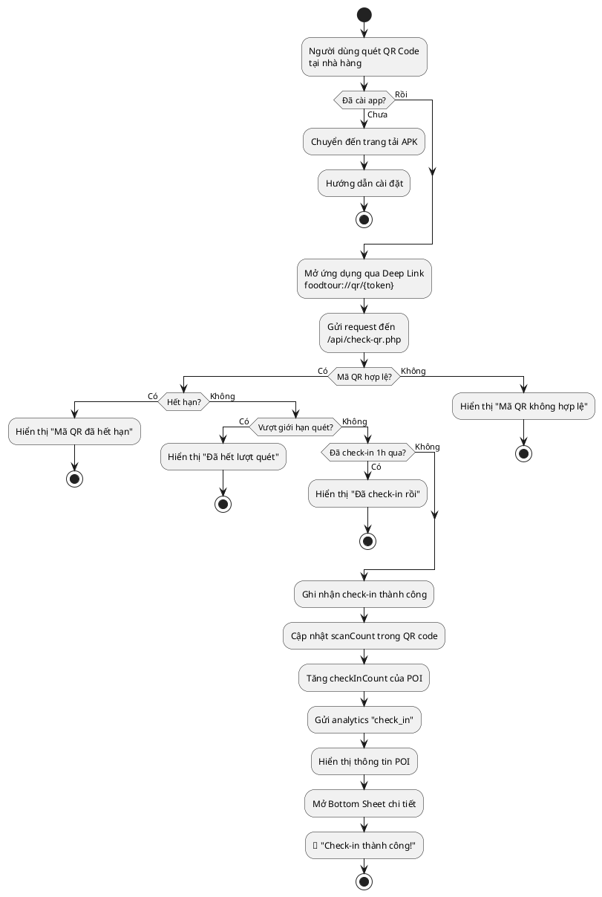

---

### ACT-03: Người dùng đánh giá nhà hàng

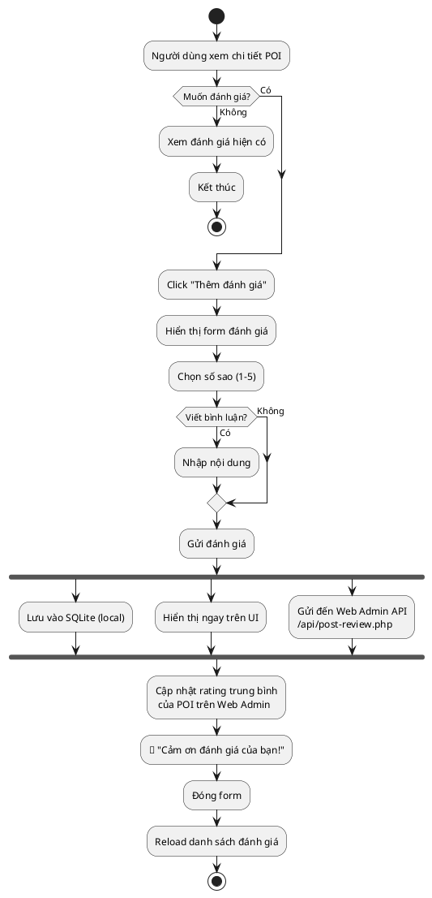

---

### ACT-04: Admin quản lý nhà hàng (POI)

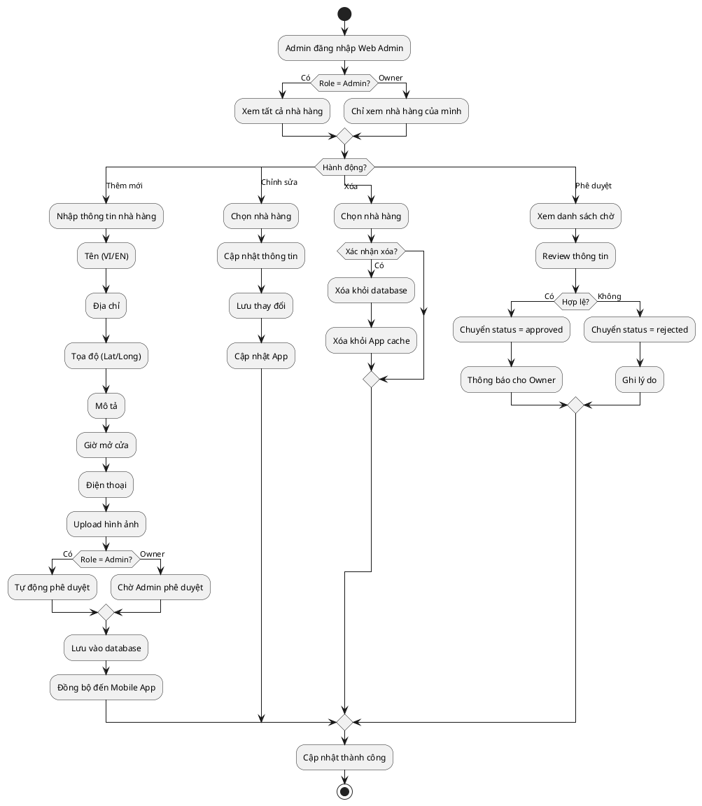

---

### ACT-05: Tạo và quản lý QR Code

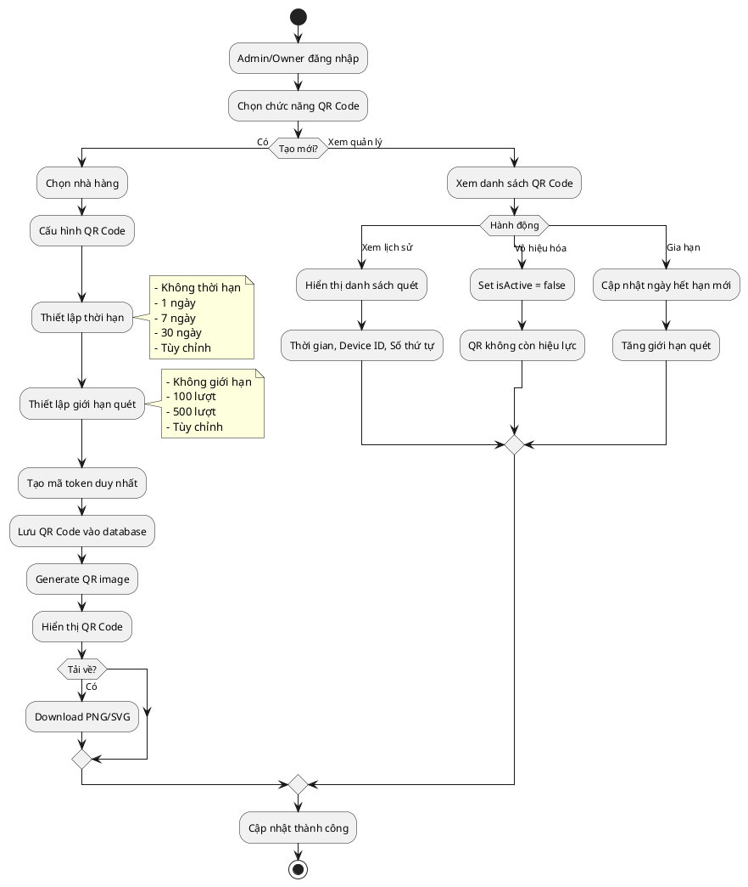

---

### ACT-06: Đồng bộ dữ liệu App ↔ Web Admin

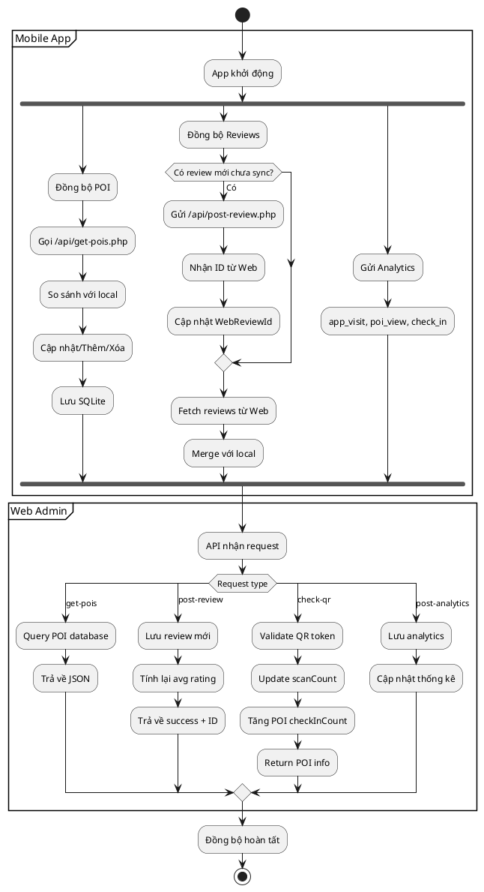

---

## 3️⃣ SEQUENCE DIAGRAMS

### SEQ-01: Người dùng vào vùng POI (Geofence Trigger)

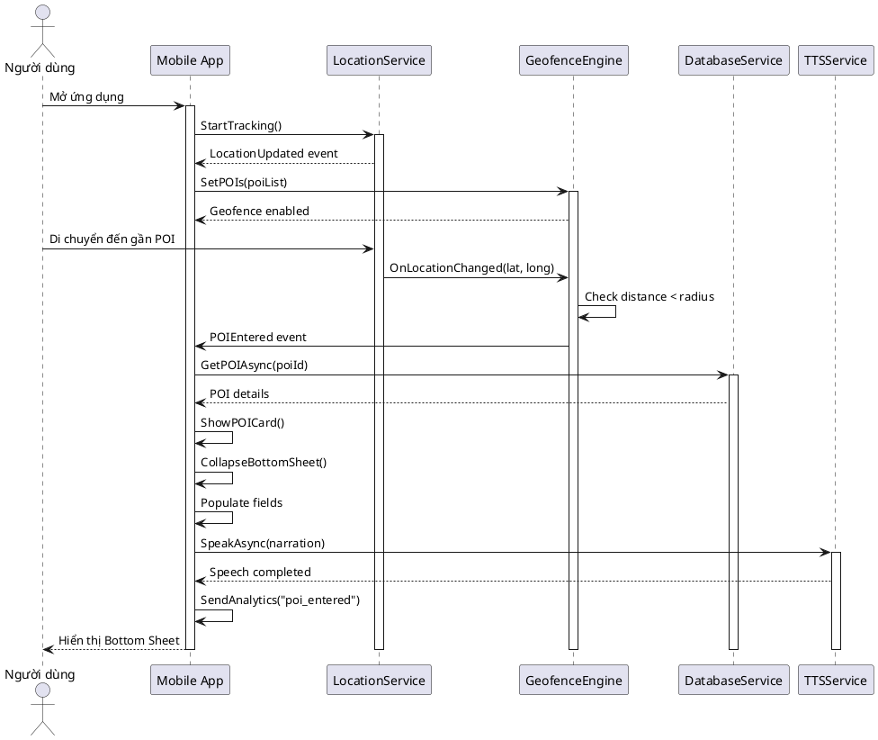

---

### SEQ-02: Check-in bằng QR Code

```plantuml
@startuml
actor "Người dùng" as User
actor "Web Browser" as Browser
participant "Mobile App" as App
participant "MainActivity" as Main
participant "ApiService" as API
participant "Web Admin\nqr-redirect.php" as WebQR
participant "Web Admin\ncheck-qr.php" as CheckQR
participant "Database\n(JSON files)" as DB

User -> Browser: Quét QR Code
activate Browser

Browser -> WebQR: GET ?token=abc123
activate WebQR

WebQR -> DB: Load QR codes
DB --> WebQR: QR data

WebQR -> WebQR: Validate token

alt App chưa cài
    WebQR --> Browser: Trang tải APK
    User -> Browser: Tải & cài đặt
else App đã cài
    WebQR --> Browser: Redirect foodtour://qr/abc123
    Browser -> App: Open deep link
    
    activate App
    App -> Main: OnCreate(intent)
    activate Main
    Main -> Main: Extract token
    Main -> App: Set DeepLinkToken
    Main --> App: MainPage()
    
    App -> API: CheckQRAsync(token, deviceId)
    activate API
    API -> CheckQR: POST {token, deviceId}
    
    activate CheckQR
    CheckQR -> DB: Load QR codes
    DB --> CheckQR: QR list
    
    CheckQR -> CheckQR: Validate QR
    CheckQR -> CheckQR: Check expiry
    CheckQR -> CheckQR: Check maxScans
    CheckQR -> CheckQR: Check cooldown
    
    alt QR hợp lệ
        CheckQR -> DB: Update scanCount
        CheckQR -> DB: Add scan record
        CheckQR -> DB: Update POI checkInCount
        DB --> CheckQR: Success
        
        CheckQR --> API: {success: true, poiId: 1, ...}
        API --> App: POI data
        
        App -> API: PostAnalytics("check_in")
        API --> App: Success
        
        App -> App: Navigate to POI Detail
        App --> User: 🎉 Check-in thành công!
        
    else QR không hợp lệ
        CheckQR --> API: {success: false, error: "..."}
        API --> App: Error
        App --> User: Hiển thị lỗi
    end
    
    deactivate CheckQR
    deactivate API
    deactivate Main
endif

deactivate WebQR
deactivate Browser
deactivate App

@enduml
```

---

### SEQ-03: Người dùng đánh giá nhà hàng

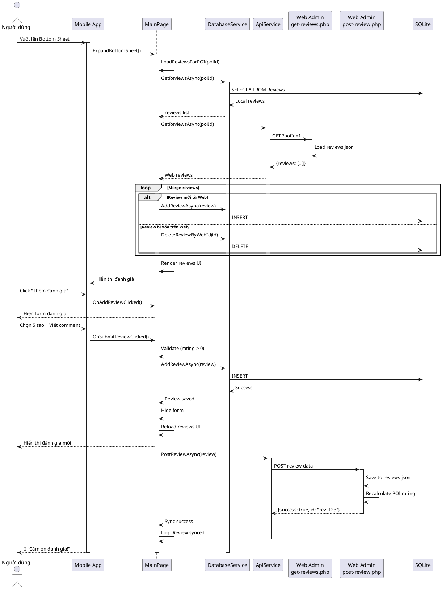

---

### SEQ-04: Admin thêm nhà hàng mới

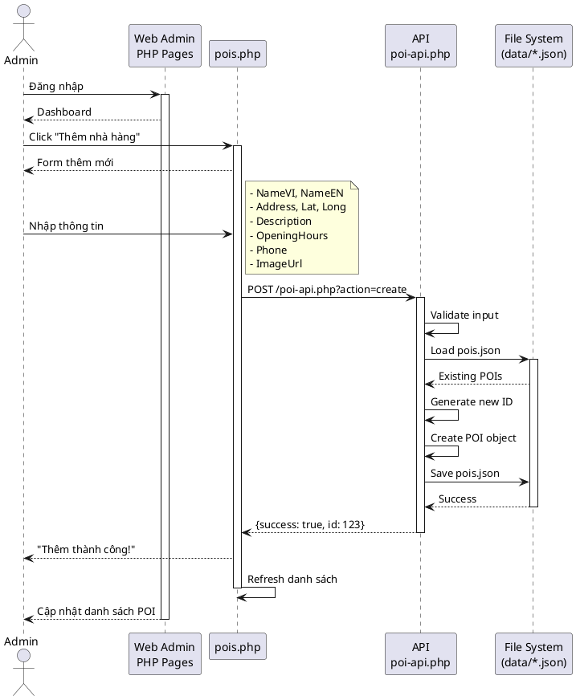

---

### SEQ-05: Tạo QR Code

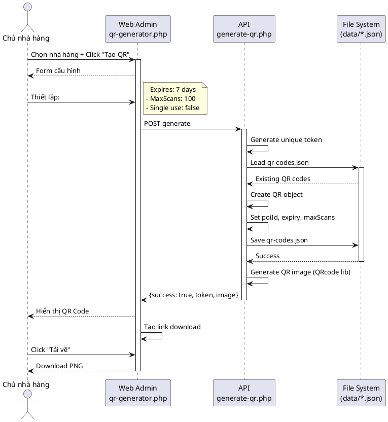

---

### SEQ-06: Xem thống kê (Analytics)

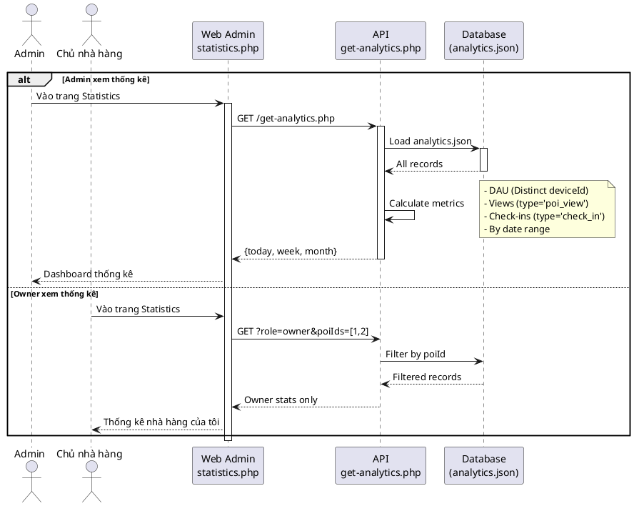

---

### SEQ-07: Đồng bộ dữ liệu (App khởi động)

```plantuml
@startuml
participant "Mobile App" as App
participant "App.xaml.cs" as AppCS
participant "ApiService" as API
participant "DatabaseService" as DB
participant "SQLite" as SQLite
participant "Web Admin\nAPI" as WebAPI
participant "File System" as FS

App -> AppCS: OnStart()
activate App
activate AppCS

par Sync POIs
    AppCS -> API: GetPOIsAsync()
    activate API
    API -> WebAPI: GET /get-pois.php
    activate WebAPI
    WebAPI -> FS: Load pois.json
    FS --> WebAPI: POI data
    WebAPI --> API: {success, data}
    deactivate WebAPI
    API --> AppCS: POI list
    deactivate API
    
    AppCS -> DB: SavePOIsAsync(list)
    activate DB
    DB -> SQLite: INSERT/UPDATE
    SQLite --> DB: Success
    DB --> AppCS: Done
    deactivate DB
    
    AppCS -> AppCS: Debug.Log("POIs synced")

and Sync Reviews
    AppCS --> DB: GetPendingReviews()
    DB -> SQLite: SELECT unsynced
    SQLite --> DB: pending list
    DB --> AppCS: reviews
    
    loop Each pending review
        AppCS -> API: PostReviewAsync()
        API -> WebAPI: POST /post-review.php
        WebAPI -> FS: Save & update rating
        WebAPI --> API: {webReviewId}
        API --> AppCS: success
        AppCS -> DB: Update WebReviewId
    end
    
    AppCS -> API: GetReviewsAsync()
    API -> WebAPI: GET /get-reviews.php
    WebAPI --> API: all reviews
    API --> AppCS: web reviews
    AppCS -> DB: MergeReviews()
end

AppCS -> AppCS: Setup completed

AppCS --> App: Ready

deactivate AppCS
deactivate App

@enduml
```

---

## 📝 Tóm tắt số lượng sơ đồ

| Loại sơ đồ | Số lượng | Chi tiết |
|------------|----------|----------|
| **Use Case** | 7 | Tổng quan, Map, QR Check-in, Review, POI Management, QR Management, Statistics |
| **Activity** | 6 | Map view, QR Check-in, Review, POI CRUD, QR Management, Data Sync |
| **Sequence** | 7 | Geofence, QR Check-in, Review, Add POI, Create QR, Analytics, App Sync |
| **TỔNG** | **20** | |

---

## 🎯 Cách xem sơ đồ

1. Copy code PlantUML
2. Dán vào [www.plantuml.com/plantuml](https://www.plantuml.com/plantuml)
3. Hoặc cài extension PlantUML trong VS Code
4. Xem trực tiếp sơ đồ được render

---

*Generated for Food Tour System - Mobile App + Web Admin*
